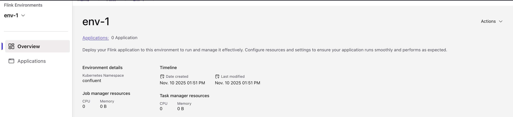

### CP-Flink and Control Center Integration

1. Port Forward to Control Center and CMF
```bash
kubectl port-forward svc/c3-control-center 9021:80 -n confluent  > /dev/null 2>&1 &
kubectl port-forward svc/cmf 9022:80 -n confluent > /dev/null 2>&1 &
```
2. Create a new environment using Confluent CLI
```bash
confluent flink environment create env1 --url http://localhost:8080 --kubernetes-namespace confluent
```
3. Create a new catalog
```bash
curl -sS -H "Content-Type: application/json" \
  -X POST http://localhost:8080/cmf/api/v1/catalogs/kafka \
  -d @catalog.json
```
4. Create a new Database
```bash
curl -sS -H "Content-Type: application/json" \
  -X POST http://localhost:8080/cmf/api/v1/catalogs/kafka/kafka-cat/databases \
  -d @database.json
```
5. Open http://localhost:9021 and check you got CP Flink available in Control Center

  